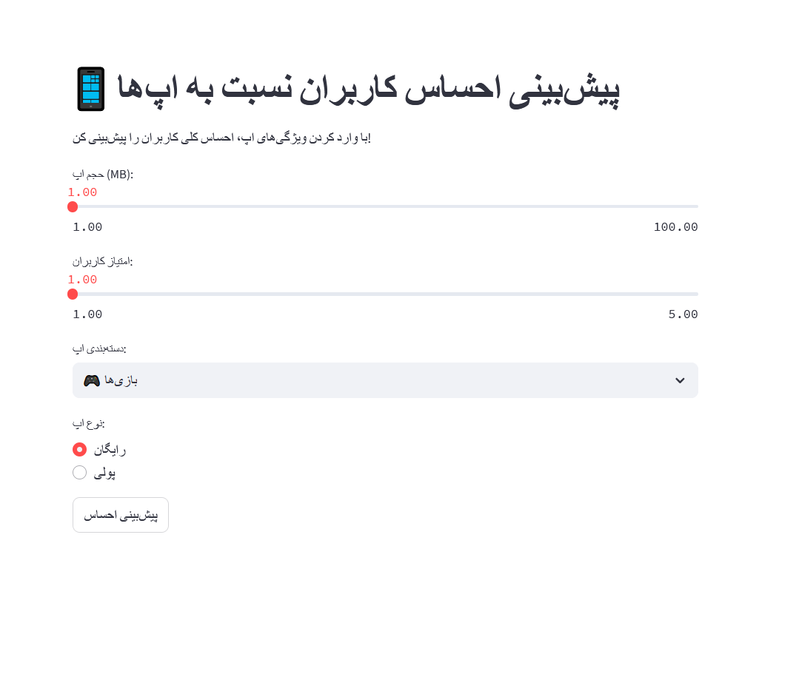

# App Sentiment Classifier

🎯 هدف پروژه: پیش‌بینی احساس کاربران نسبت به اپ‌های پلی‌استور (مثبت یا منفی) با تحلیل ویژگی‌های اپ

دیتاست: https://www.datacamp.com/datalab/datasets/dataset-python-google-play-store-apps

خروجی: https://appclassifier.streamlit.app/


## 🔧 ابزارهای استفاده‌شده

- Python (Pandas, Scikit-learn, Streamlit, XGBoost)
- Excel
- streamlit Cloud
- GitHub for version control


## 📊 مراحل پروژه

1. **پیش‌پردازش و پاک‌سازی داده‌ها**
2. **تحلیل آماری و بصری**
3. **مهندسی ویژگی‌ها (Feature Engineering)**
4. **مدل‌سازی با XGBoost و Ranfom Forest**
5. **تحلیل دقیق با SHAP برای تفسیر مدل**
6. **داشبورد تعاملی با Streamlit**
7. **آماده‌سازی برای انتشار در GitHub و Streamlit Cloud**


## 🚀 خروجی‌ها

- 🌐 اپ Streamlit (`app/app_sentiment.py`)
- 📋 تحلیل عددی، مهندسی ویژگی و بررسی مدل (Jupyter Notebook)


## 🌐 لینک پروژه در گیت هاب

[مشاهده پروژه در GitHub](https://github.com/eliram88/app_sentiment-classifier)


## 💡 ویژگی‌های کلیدی

✅ قابلیت پیش‌بینی احساس کاربران نسبت به اپ‌ها  
✅ تحلیل دقیق دلیل تصمیم‌گیری مدل با استفاده از SHAP  
✅ داشبورد کاملاً تعاملی برای استفاده توسط کاربران غیرتکنیکی  


## 🎯 برای اجرای اپ Streamlit:

```bash
pip install -r app/requirements.txt
streamlit run app/app_sentiment.py
 ```

### 🌐 اجرای اپ آنلاین در Streamlit Cloud:
https://appclassifier.streamlit.app/


## 📁 ساختار فایل‌ها
```bash
app_sentiment_classifier/
│
├── 📁 data/
│   └── googleplaystore.csv                # دیتای اصلی
│   └── googleplaystore_user_reviews.csv   
│
├── 📁 notebook/
│   └── APPclassifier.ipynb                # تحلیل داده و مدل‌سازی (Jupyter Notebook)
│
├── 📁 app/
│   └── app_sentiment.py                 # اپ Streamlit
│   └── requirements.txt                 # لیست کتابخانه‌ها
│   └── xgb_sentiment_model.pkl          # مدل ذخیره‌شده
│
├── 📁 dashboard/
│   └── dashboard-screenshot.png         # تصویر داشبورد نهایی streamlit
│
├── 📄 README.md                         # توضیح پروژه (همین فایل)
```

## 🧑‍💻 توسعه‌دهنده

این پروژه توسط یک علاقه‌مند به تحلیل داده و یادگیری ماشین طراحی و اجرا شده  
با هدف شرکت در موقعیت های "تحلیلگر داده / دیتا ساینتیست".

✨ هدف: توسعه نمونه کار قابل ارائه، تمرین تحلیل واقعی، یادگیری مدل‌سازی حرفه‌ای و تفسیر مدل
