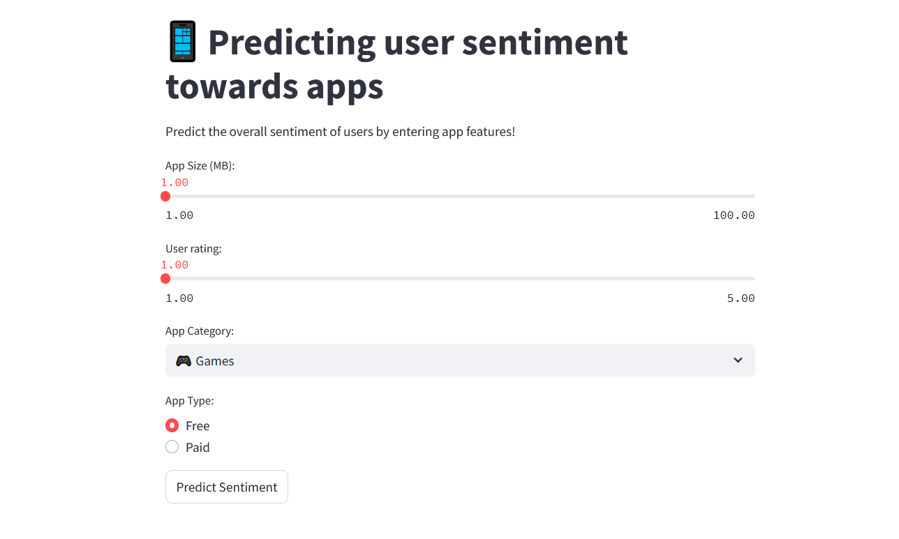

# App Sentiment Classifier

🎯 Project goal: Predict user sentiment (positive or negative) toward Google Play Store apps by analyzing app features and user reviews

Dataset: https://www.datacamp.com/datalab/datasets/dataset-python-google-play-store-apps
Result: https://appclassifier.streamlit.app/


## 🔧 Tools & Libraries

- Python (Pandas, Scikit-learn, Streamlit, XGBoost)
- Excel
- streamlit Cloud
- GitHub for version control


## 📊 📊 Project Workflow

1. **Data Preprocessing & Cleaning**
2. **Statistical & Visual Analysis**
3. **Feature Engineering**
4. **Modeling with XGBoost and Random Forest**
5. **Model Interpretation with SHAP**
6. **Interactive Dashboard with Streamlit**
7. **Deployment on GitHub & Streamlit Cloud**


## 🚀 Outputs

- 🌐 Streamlit App → app/app_sentiment.py
- 📋 Data Analysis & Modeling → Jupyter Notebook


## 🌐 Project Link in GitHub

[View project in GitHub](https://github.com/eliram88/app_sentiment-classifier)


## 💡 Key Features

✅ Predicting user sentiment toward mobile applications
✅ Explainable ML decisions using SHAP values
✅ Fully interactive dashboard for non-technical users


## 🎯 Run the Streamlit App

```bash
pip install -r app/requirements.txt
streamlit run app/app_sentiment.py
 ```

### 🌐 Online App

[Streamlit Cloud Deployment](https://appclassifier.streamlit.app/)  


## 📁 Project Structure
```bash
app_sentiment_classifier/
│
├── 📁 data/
│   └── googleplaystore.csv                # Main dataset
│   └── googleplaystore_user_reviews.csv   # User reviews
│
├── 📁 notebook/
│   └── APPclassifier.ipynb                # Data analysis & modeling
│
├── 📁 app/
│   └── app_sentiment.py                 # Streamlit app
│   └── requirements.txt                 # Dependencies 
│   └── xgb_sentiment_model.pkl          # Trained ML model
│
├── 📁 dashboard/
│   └── dashboard-screenshot.png         # Dashboard screenshot
│
├── 📄 README.md                         # Project documentation
```


## 👨‍💻 Developer

This project was developed by a data analysis and machine learning enthusiast with the goal of:

- Building a professional portfolio project
- Practicing real-world data analysis & modeling
- Deploying ML models in interactive apps
